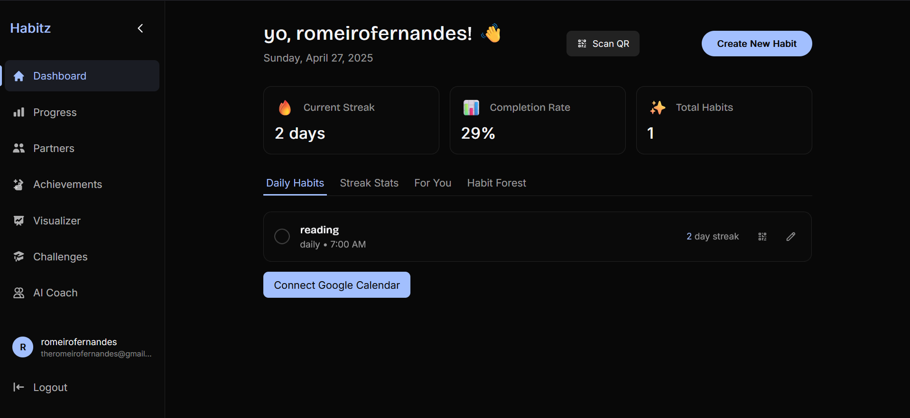
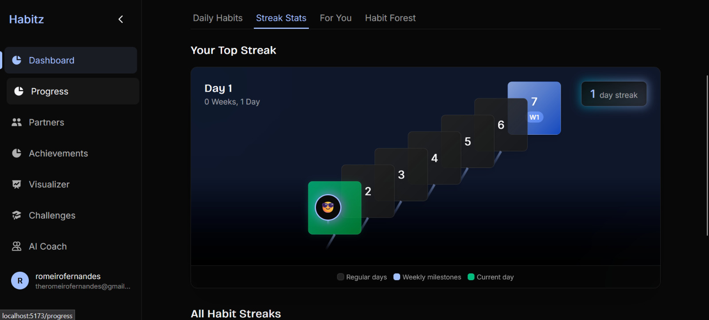

# 🚀 Habitz

> Ultimate habit-building and social accountability for lasting change.

---

## 📌 Problem Statement

**Problem Statement 9 – Build the Ultimate Digital Habit Builder**

---

## 🎯 Objective

Habitz helps users build and sustain positive habits through gamification, social features, and AI-powered coaching.  
It serves anyone seeking to improve their routines—students, professionals, wellness enthusiasts—by making habit formation engaging, visual, and collaborative.

---

## 🧠 Team & Approach

### Team Name:  
`HackJS`

### Team Members:  
- Romeiro Fernandes ([GitHub](https://github.com/romeirofernandes))  
- Aliqyaan Mahimwala ([GitHub](https://github.com/Hike-12))
- Liza Castelino ([GitHub](https://github.com/glanisha))
- Gavin Soares ([GitHub](https://github.com/gavin100305))

### Our Approach:  
- Chose this problem to address the universal struggle of sticking to habits and the lack of engaging, supportive tools.
- Key challenges: real-time progress sync, habit visualization, social accountability, and AI-driven recommendations.
- Pivoted from a basic tracker to a gamified, community-driven platform with habit visualizer, QR progress, and AI coach.

---

## 🛠️ Tech Stack

### Core Technologies Used:
- **Frontend:** React.js, Framer Motion, Tailwind CSS
- **Backend:** Node.js, Express.js
- **Database:** MongoDB (Mongoose)
- **APIs:** RESTful API, Google Calendar API, Groq (AI), Fluvio (WebSocket)
- **Hosting:** Vercel (frontend), Render.com (backend)

### Sponsor Technologies Used:
- ✅ **Groq:** AI-powered habit coach, habit visualizer (Mermaid diagrams), recommendations, and forecasting

---

## ✨ Key Features

- ✅ **Habit Tracking:** Create, edit, and complete daily/weekly habits with streaks and reminders
- ✅ **Gamified Visualizations:** 3D Streak Staircase, Habit Forest, and Mermaid-based habit flowcharts
- ✅ **Social Accountability:** Add partners, chat, and view each other's progress
- ✅ **Challenges:** Join/create public challenges, track progress, compete on leaderboards
- ✅ **AI Coach:** Personalized habit advice and habit visualizations powered by Groq
- ✅ **QR Codes:** Generate/scan QR codes to update habit/challenge progress
- ✅ **Progress Analytics:** Weekly/monthly stats, contribution graph, productivity insights
- ✅ **Google Calendar Sync:** Sync habits with your calendar for reminders




---

## 📽️ Demo & Deliverables

- **Demo Video Link:** [https://youtu.be/zlo9BYoM4gA?si=ornX0cQQ58X-pQ8k]

---

## ✅ Tasks & Bonus Checklist

- ✅ **All members completed mandatory social tasks**
- ✅ **All members completed Bonus Task 1 (Badges)**
- ✅ **All members completed Bonus Task 2 (Sprint.dev signup)**

---

## 🧪 How to Run the Project

### Requirements:
- Node.js (v18+)
- MongoDB
- API Keys for Groq, Google Calendar, etc.
- `.env` file with all secrets (see `.env.example`)

### Local Setup:
```bash
# Clone the repo
git clone https://github.com/hackhazard/habitz

# Install dependencies for frontend
cd HackHazard/Frontend
npm install

# Install dependencies for backend
cd ../Backend
npm install

# Start backend server
npm run dev

# Start frontend dev server (in another terminal)
cd ../Frontend
npm run dev
```
- Set up your `.env` files in both `Frontend` and `Backend` directories.
- MongoDB must be running locally or use MongoDB Atlas.

---

## 🧬 Future Scope

- 📈 Deeper analytics and habit recommendations
- 🛡️ Enhanced privacy and security (OAuth, 2FA)
- 🌐 Localization and accessibility improvements
- 📱 Mobile app (React Native)
- 🧩 More integrations (Fitbit, Apple Health, etc.)
- 🏆 Public leaderboards and seasonal events

---

## 📎 Resources / Credits

- [Groq API](https://groq.com/)
- [Framer Motion](https://www.framer.com/motion/)
- [Mermaid.js](https://mermaid-js.github.io/)
- [Open source icons & illustrations](https://lucide.dev/)
- Special thanks to mentors, hackathon organizers, and all open source contributors!

---

## 🏁 Final Words

Building Habitz was a fun, challenging, and rewarding journey!  
We learned to blend gamification, AI, and social features to make habit-building truly engaging.  
Shout-out to our team for late-night debugging, creative brainstorming, and never giving up.  
Excited to keep hacking and help more people build better habits!

---